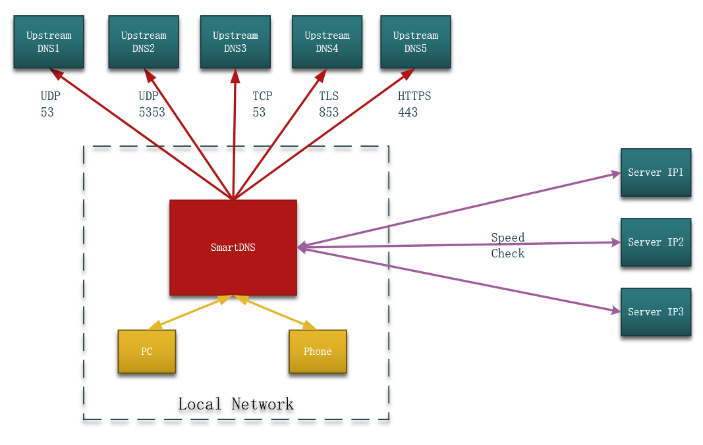

# SmartDNS

  
SmartDNS是一个运行在本地的DNS服务器，SmartDNS接受本地客户端的DNS查询请求，从多个上游DNS服务器获取DNS查询结果，并将访问速度最快的结果返回给客户端，避免DNS污染，提高网络访问速度。
同时支持指定特定域名IP地址，并高性匹配，达到过滤广告的效果。  
与dnsmasq的all-servers不同，smartdns返回的是访问速度最快的解析结果。  

支持树莓派，openwrt，华硕路由器等设备。  

## 软件效果展示

**阿里DNS**  
使用阿里DNS查询百度IP，并检测结果。  

```shell
pi@raspberrypi:~/code/smartdns_build $ nslookup www.baidu.com 223.5.5.5
Server:         223.5.5.5
Address:        223.5.5.5#53

Non-authoritative answer:
www.baidu.com   canonical name = www.a.shifen.com.
Name:   www.a.shifen.com
Address: 180.97.33.108
Name:   www.a.shifen.com
Address: 180.97.33.107

pi@raspberrypi:~/code/smartdns_build $ ping 180.97.33.107 -c 2
PING 180.97.33.107 (180.97.33.107) 56(84) bytes of data.
64 bytes from 180.97.33.107: icmp_seq=1 ttl=55 time=24.3 ms
64 bytes from 180.97.33.107: icmp_seq=2 ttl=55 time=24.2 ms

--- 180.97.33.107 ping statistics ---
2 packets transmitted, 2 received, 0% packet loss, time 1001ms
rtt min/avg/max/mdev = 24.275/24.327/24.380/0.164 ms
pi@raspberrypi:~/code/smartdns_build $ ping 180.97.33.108 -c 2
PING 180.97.33.108 (180.97.33.108) 56(84) bytes of data.
64 bytes from 180.97.33.108: icmp_seq=1 ttl=55 time=31.1 ms
64 bytes from 180.97.33.108: icmp_seq=2 ttl=55 time=31.0 ms

--- 180.97.33.108 ping statistics ---
2 packets transmitted, 2 received, 0% packet loss, time 1001ms
rtt min/avg/max/mdev = 31.014/31.094/31.175/0.193 ms
```

**smartdns**  
使用SmartDNS查询百度IP，并检测结果。

```shell
pi@raspberrypi:~/code/smartdns_build $ nslookup www.baidu.com
Server:         192.168.1.1
Address:        192.168.1.1#53

Non-authoritative answer:
www.baidu.com   canonical name = www.a.shifen.com.
Name:   www.a.shifen.com
Address: 14.215.177.39

pi@raspberrypi:~/code/smartdns_build $ ping 14.215.177.39 -c 2
PING 14.215.177.39 (14.215.177.39) 56(84) bytes of data.
64 bytes from 14.215.177.39: icmp_seq=1 ttl=56 time=6.31 ms
64 bytes from 14.215.177.39: icmp_seq=2 ttl=56 time=5.95 ms

--- 14.215.177.39 ping statistics ---
2 packets transmitted, 2 received, 0% packet loss, time 1001ms
rtt min/avg/max/mdev = 5.954/6.133/6.313/0.195 ms

```

从对比看出，smartdns找到访问www.baidu.com最快的IP地址，这样访问百度比阿里DNS速度快5倍。

## 特性

1. **多DNS上游服务器**  
   支持配置多个上游DNS服务器，并同时进行查询，即使其中有DNS服务器异常，也不会影响查询。  

2. **返回最快IP地址**  
   支持从域名所属IP地址列表中查找到访问速度最快的IP地址，并返回给客户端，避免DNS污染，提高网络访问速度。

3. **支持多种查询协议**  
   支持UDP，TCP，TLS查询，以及非53端口查询，有效避免DNS污染。

4. **特定域名IP地址指定**  
   支持指定域名的IP地址，达到广告过滤效果，避免恶意网站的效果。

5. **域名高性能后缀匹配**  
   支持域名后缀匹配模式，简化过滤配置，过滤20万条记录时间<1ms

6. **Linux多平台支持**  
   支持标准Linux系统（树莓派），openwrt系统各种固件，华硕路由器原生固件。

7. **支持IPV4, IPV6双栈**  
   支持IPV4，IPV6网络，支持查询A, AAAA记录，支持双栈IP速度优化。

8. **高性能，占用资源少**  
   多线程异步IO模式，cache缓存查询结果。

## 架构



1. SmartDNS接收本地网络设备的DNS查询请求，如PC，手机的查询请求。  
2. SmartDNS将查询请求发送到多个上游DNS服务器，可采用标准UDP查询，非标准端口UDP查询，及TCP查询。  
3. 上游DNS服务器返回域名对应的Server IP地址列表。SmartDNS检测与本地网络访问速度最快的Server IP。  
4. 将访问速度最快的Server IP返回给本地客户端。  

## 使用

### 下载配套安装包  

--------------

下载配套版本的SmartDNS安装包，对应安装包配套关系如下。

|系统 |安装包|说明
|-----|-----|-----
|标准Linux系统(树莓派)| smartdns.xxxxxxxx.armhf.deb|支持树莓派Raspbian stretch，Debian 9系统。
|标准Linux系统(x86_64)| smartdns.xxxxxxxx.x86_64.tar.gz|支持x86_64系统。
|标准Linux系统(x86)| smartdns.xxxxxxxx.x86.tar.gz|支持x86系统。
|华硕原生固件(optware)|smartdns.xxxxxxx.mipsbig.ipk|支持MIPS大端架构的系统，如RT-AC55U, RT-AC66U.
|华硕原生固件(optware)|smartdns.xxxxxxx.mipsel.ipk|支持MIPS小端架构的系统，如RT-AC68U。
|华硕原生固件(optware)|smartdns.xxxxxxx.arm.ipk|支持arm小端架构的系统，如RT-AC88U。
|openwrt 15.01|smartdns.xxxxxxxx.ar71xx.ipk|支持AR71XX MIPS系统。
|openwrt 15.01|smartdns.xxxxxxxx.ramips_24kec.ipk|支持MT762X等小端路由器
|openwrt 15.01(潘多拉)|smartdns.xxxxxxxx.mipsel_24kec_dsp.ipk|支持MT7620系列的潘多拉固件
|openwrt 18.06|smartdns.xxxxxxxx.mips_24kc.ipk|支持AR71XX MIPS系统。
|openwrt 18.06|smartdns.xxxxxxxx.mipsel_24kc.ipk|支持MT726X等小端路由器
|openwrt 18.06|smartdns.xxxxxxxx.x86_64.ipk|支持x86_64路由器
|openwrt 18.06|smartdns.xxxxxxxx.i386_pentium4.ipk|支持x86路由器
|openwrt 18.06|smartdns.xxxxxxxxxxx.arm_cortex-a9.ipk|支持arm A9核心CPU的路由器
|openwrt 18.06|smartdns.xxxxxxxxx.arm_cortex-a7_neon-vfpv4.ipk|支持arm A7核心CPU的路由器
|openwrt LUCI|luci-app-smartdns.xxxxxxxxx.xxxx.all.ipk|openwrt管理统一界面

* openwrt系统CPU架构比较多，上述表格未列出所有支持系统，请查看CPU架构后下载。
* merlin梅林固件理论和华硕固件一致，所以根据硬件类型安装相应的ipk包即可。（梅林暂时未验证，有问题提交issue）
* CPU架构可在路由器管理界面找到，查看方法：
    登录路由器，点击`System`->`Software`，点击`Configuration` Tab页面，在opkg安装源中可找到对应软件架构，下载路径中可找到，如下，架构为ar71xx

    ```shell
    src/gz chaos_calmer_base http://downloads.openwrt.org/chaos_calmer/15.05/ar71xx/generic/packages/base
    ```

    请在Release页面下载：[此处下载](https://github.com/pymumu/smartdns/releases)

### 标准Linux系统安装（树莓派, X86_64系统）

--------------

1. 安装

    下载配套安装包`smartdns.xxxxxxxx.armhf.deb`，并上传到Linux系统中。 执行如下命令安装

    ```shell
    dpkg -i smartdns.xxxxxxxx.armhf.deb
    ```

1. 修改配置

    安装完成后，可配置smartdns的上游服务器信息。具体配置参数参考`配置参数`说明。  
    一般情况下，只需要增加`server [IP]:port`, `server-tcp [IP]:port`配置项，
    尽可能配置多个上游DNS服务器，包括国内外的服务器。配置参数请查看`配置参数`章节。

    ```shell
    vi /etc/smartdns/smartdns.conf
    ```

1. 启动服务

    ```shell
    systemctl enable smartdns
    systemctl start smartdns
    ```

1. 将DNS请求转发的SmartDNS解析。

    修改本地路由器的DNS服务器，将DNS服务器配置为SmartDNS。
    * 登录到本地网络的路由器中，配置树莓派分配静态IP地址。
    * 修改WAN口或者DHCP DNS为树莓派IP地址。  
    注意：  
    I. 每款路由器配置方法不尽相同，请百度搜索相关的配置方法。  
    II.华为等路由器可能不支持配置DNS为本地IP，请修改PC端，手机端DNS服务器为树莓派IP。

1. 检测服务是否配置成功。

    使用`nslookup -querytype=ptr 0.0.0.0`查询域名  
    看命令结果中的`name`项目是否显示为`smartdns`或`主机名`，如`smartdns`则表示生效  

    ```shell
    pi@raspberrypi:~/code/smartdns_build $ nslookup -querytype=ptr 0.0.0.0
    Server:         192.168.1.1
    Address:        192.168.1.1#53

    Non-authoritative answer:
    0.0.0.0.in-addr.arpa  name = smartdns.
    ```

### openwrt/LEDE

--------------

1. 安装

    将软件使用winscp上传到路由器的/root目录，执行如下命令安装  

    ```shell
    opkg install smartdns.xxxxxxxx.xxxx.ipk
    opkg install luci-app-smartdns.xxxxxxxx.xxxx.all.ipk
    ```

1. 修改配置

    登录openwrt管理页面，打开`Services`->`SmartDNS`进行配置。
    * 在`Upstream Servers`增加上游DNS服务器配置，建议配置多个国内外DNS服务器。
    * 在`Domain Address`指定特定域名的IP地址，可用于广告屏蔽。

1. 启用服务

   SmartDNS服务生效方法有两种，`一种是直接作为主DNS服务`；`另一种是作为dnsmasq的上游`。  
   默认情况下，SmartDNS采用第一种方式。如下两种方式根据需求选择即可。

1. 启用方法一：作为主DNS(默认方案)

    * **启用smartdns的53端口重定向**

        登录路由器，点击`Services`->`SmartDNS`->`redirect`，选择`重定向53端口到SmartDNS`启用53端口转发。

    * **检测转发服务是否配置成功**

        使用`nslookup -querytype=ptr 0.0.0.0`查询域名  
        看命令结果中的`name`项目是否显示为`smartdns`或`主机名`，如`smartdns`则表示生效  

        ```shell
        pi@raspberrypi:~/code/smartdns_build $ nslookup -querytype=ptr 0.0.0.0
        Server:         192.168.1.1
        Address:        192.168.1.1#53

        Non-authoritative answer:
        0.0.0.0.in-addr.arpa  name = smartdns.
        ```

    * **界面提示重定向失败**

        * 检查iptable，ip6table命令是否正确安装。
        * openwrt 15.01系统不支持IPV6重定向，如网络需要支持IPV6，请将DNSMASQ上游改为smartdns，或者将smartdns的端口改为53，并停用dnsmasq。
        * LEDE之后系统，请安装IPV6的nat转发驱动。点击`system`->`Software`，点击`update lists`更新软件列表后，安装`ip6tables-mod-nat`
        * 使用如下命令检查路由规则是否生效。  

        ```shell
        iptables -t nat -L PREROUTING | grep REDIRECT
        ```
        * 如转发功能不正常，请使用方法二：作为DNSMASQ的上游。

1. 方法二：作为DNSMASQ的上游

    * **将dnsmasq的请求发送到smartdns**

        登录路由器，点击`Services`->`SmartDNS`->`redirect`，选择`作为dnsmasq的上游服务器`设置dnsmasq的上游服务器为smartdns。

    * **检测上游服务是否配置成功**

        * 方法一：使用`nslookup -querytype=ptr 0.0.0.0`查询域名  
        看命令结果中的`name`项目是否显示为`smartdns`或`主机名`，如`smartdns`则表示生效  

        ```shell
        pi@raspberrypi:~/code/smartdns_build $ nslookup -querytype=ptr 0.0.0.0
        Server:         192.168.1.1
        Address:        192.168.1.1#53

        Non-authoritative answer:
        0.0.0.0.in-addr.arpa  name = smartdns.
        ```

        * 方法二：使用`nslookup`查询`www.baidu.com`域名，查看结果中百度的IP地址是否`只有一个`，如有多个IP地址返回，则表示未生效，请多尝试几个域名检查。

        ```shell
        pi@raspberrypi:~ $ nslookup www.baidu.com 192.168.1.1
        Server:         192.168.1.1
        Address:        192.168.1.1#53

        Non-authoritative answer:
        www.baidu.com   canonical name = www.a.shifen.com.
        Name:   www.a.shifen.com
        Address: 14.215.177.38
        ```

1. 启动服务

    勾选配置页面中的`Enable(启用)`来启动SmartDNS

1. 注意：

    * 如已经安装chinaDNS，建议将chinaDNS的上游配置为SmartDNS。
    * SmartDNS默认情况，将53端口的请求转发到SmartDNS的本地端口，由`Redirect`配置选项控制。

### 华硕路由器原生固件/梅林固件

--------------

说明：梅林固件派生自华硕固件，理论上可以直接使用华硕配套的安装包使用。但目前未经验证，如有问题，请提交issue。

1. 准备

    在使用此软件时，需要确认路由器是否支持U盘，并准备好U盘一个。

1. 启用SSH登录

    登录管理界面，点击`系统管理`->点击`系统设置`，配置`Enable SSH`为`Lan Only`。  
    SSH登录用户名密码与管理界面相同。

1. 下载`Download Master`

    在管理界面点击`USB相关应用`->点击`Download Master`下载。  
    下载完成后，启用`Download Master`，如果不需要下载功能，此处可以卸载`Download Master`，但要保证卸载前Download Master是启用的。  

1. 安装SmartDNS

    将软件使用winscp上传到路由器的`/tmp/mnt/sda1`目录。（或网上邻居复制到sda1共享目录）

    ```shell
    ipkg install smartdns.xxxxxxx.mipsbig.ipk
    ```

1. 重启路由器生效服务

    待路由器启动后，使用`nslookup -querytype=ptr 0.0.0.0`查询域名  
    看命令结果中的`name`项目是否显示为`smartdns`或`主机名`，如`smartdns`则表示生效  

    ```shell
    pi@raspberrypi:~/code/smartdns_build $ nslookup -querytype=ptr 0.0.0.0
    Server:         192.168.1.1
    Address:        192.168.1.1#53

    Non-authoritative answer:
    0.0.0.0.in-addr.arpa  name = smartdns.
    ```

1. 额外说明

    上述过程，smartdns将安装到U盘根目录，采用optware的模式运行。
    其目录结构如下： （此处仅列出smartdns相关文件）  

    ```shell
    U盘
    └── asusware.mipsbig
            ├── bin
            ├── etc
            |    ├── smartdns
            |    |     └── smartdns.conf
            |    └── init.d
            |          └── S50smartdns
            ├── lib
            ├── sbin
            ├── usr
            |    └── sbin
            |          └── smartdns
            ....
    ```

    如要修改配置，可以ssh登录路由器，使用vi命令修改  

    ```shell
    vi /opt/etc/smartdns/smartdns.conf
    ```

    也可以通过网上邻居修改，网上邻居共享目录`sda1`看不到`asusware.mipsbig`目录，但可以直接在`文件管理器`中输入`asusware.mipsbig\etc\init.d`访问

    ```shell
    \\192.168.1.1\sda1\asusware.mipsbig\etc\init.d
    ```

## 配置参数

|参数|功能|默认值|配置值|例子|
|--|--|--|--|--|
|server-name|DNS服务器名称|操作系统主机名/smartdns|符合主机名规格的字符串|server-name smartdns
|bind|DNS监听端口号|[::]:53|IP:PORT|bind 192.168.1.1:53
|bind-tcp|TCP模式DNS监听端口号|[::]:53|IP:PORT|bind-tcp 192.168.1.1:53
|cache-size|域名结果缓存个数|512|数字|cache-size 512
|tcp-idle-time|TCP链接空闲超时时间|120|数字|tcp-idle-time 120
|rr-ttl|域名结果TTL|远程查询结果|大于0的数字|rr-ttl 600
|rr-ttl-min|允许的最小TTL值|远程查询结果|大于0的数字|rr-ttl-min 60
|rr-ttl-max|允许的最大TTL值|远程查询结果|大于0的数字|rr-ttl-max 600
|log-level|设置日志级别|error|error,warn,info,debug|log-level error
|log-file|日志文件路径|/var/log/smartdns.log|路径|log-file /var/log/smartdns.log
|log-size|日志大小|128K|数字+K,M,G|log-size 128K
|log-num|日志归档个数|2|数字|log-num 2
|audit-enable|设置审计启用|no|[yes\|no]|audit-enable yes
|audit-file|审计文件路径|/var/log/smartdns-audit.log|路径|audit-file /var/log/smartdns-audit.log
|audit-size|审计大小|128K|数字+K,M,G|audit-size 128K
|audit-num|审计归档个数|2|数字|audit-num 2
|conf-file|附加配置文件|无|文件路径|conf-file /etc/smartdns/smartdns.more.conf
|server|上游UDP DNS|无|[ip][:port] [-blacklist-ip][-check-edns]，可重复，blacklist-ip参数指定使用blacklist-ip配置IP过滤结果| server 8.8.8.8:53 -blacklist-ip -check-edns
|server-tcp|上游TCP DNS|无|[IP][:port] [-blacklist-ip][-check-edns]，可重复，blacklist-ip参数指定使用blacklist-ip配置IP过滤结果| server-tcp 8.8.8.8:53
|server-tls|上游TLS DNS|无|[IP][:port] [-blacklist-ip][-check-edns]，可重复，blacklist-ip参数指定使用blacklist-ip配置IP过滤结果| server-tls 8.8.8.8:853
|address|指定域名IP地址|无|address /domain/[ip\|-\|-4\|-6\|#\|#4\|#6], `-`表示忽略, `#`表示返回SOA, `4`表示IPV4, `6`表示IPV6| address /www.example.com/1.2.3.4
|ipset|域名IPSET|None|ipset /domain/[ipset\|-], `-`表示忽略|ipset /www.example.com/pass
|bogus-nxdomain|假冒IP地址过滤|无|[ip/subnet]，可重复| bogus-nxdomain 1.2.3.4/16
|blacklist-ip|黑名单IP地址|无|[ip/subnet]，可重复| blacklist-ip 1.2.3.4/16
|force-AAAA-SOA|强制AAAA地址返回SOA|no|[yes\|no]|force-AAAA-SOA yes
|dualstack-ip-selection|双栈IP优选|no|[yes\|no]|dualstack-ip-selection yes
|dualstack-ip-selection-threshold|双栈IP优选阈值|100ms|毫秒|dualstack-ip-selection-threshold [1-1000]

## [Donate](#Donate)  

如果你觉得此项目对你有帮助，请捐助我们，以使项目能持续发展，更加完善。

### PayPal

[](https://paypal.me/PengNick/)

### Alipay 支付宝


### Wechat 微信
  


## 声明

* `SmartDNS`著作权归属Nick Peng (pymumu at gmail.com)。
* `SmartDNS`为免费软件，用户可以非商业性地复制和使用`SmartDNS`。
* 禁止将 `SmartDNS` 用于商业用途。
* 使用本软件的风险由用户自行承担，在适用法律允许的最大范围内，对因使用本产品所产生的损害及风险，包括但不限于直接或间接的个人损害、商业赢利的丧失、贸易中断、商业信息的丢失或任何其它经济损失，不承担任何责任。
* 本软件不会未经用户同意收集任何用户信息。

## 说明

目前代码未开源，后续根据情况开源。
